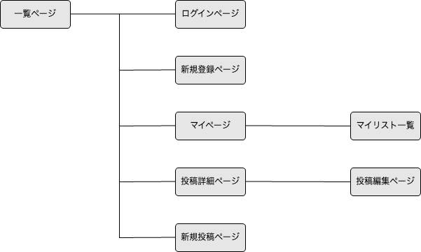

# アプリケーション名
REHA BASE

# アプリケーション概要
患者のニーズに合わせた治療を検索することができ、その治療のエビデンスグレードについても知ることができる
# URL
https://rehabase.onrender.com
# テスト用アカウント

# 利用方法
## リハビリテーションの検索
1、トップページ（一覧ページ）へ遷移  
2、キーワード、カテゴリー等を指定し検索

## リハビリテーション内容の投稿
1、トップページ（一覧ページ）から、新規登録ページへ遷移する  
2、ユーザーの新規登録を行う  
3、トップページ等のヘッダーから新規投稿画面へ遷移する  
4、投稿フォーム内の項目を入力し投稿する  

## 投稿に対してのコメント
1、トップページ（一覧ページ）から、新規登録ページへ遷移する  
2、ユーザーの新規登録を行う  
3、興味がある投稿を見つける  
4、投稿詳細ページへ遷移し、ページ最下部へ移動  
5、投稿に対しての質問やリハビリテーションの内容についての意見等を入力し、送信する  

## マイリスト登録
1、トップページ（一覧ページ）から、新規登録ページへ遷移する  
2、ユーザーの新規登録を行う  
3、興味がある投稿を見つける  
4、投稿詳細ページへと遷移し、タイトル横のリスト登録ボタンを押す  
5、自身のマイページよりマイリストの確認可能  

# アプリケーションを作成した背景

# 洗い出した要件
https://docs.google.com/spreadsheets/d/1LJOzNiofhEDTgr8ManRJi1SUHJ99t8n0gdAmNDzDxGk/edit#gid=982722306
# 実装した機能についての画像・GIFおよびその説明

# 実装予定の機能
優先的にユーザー管理機能、投稿機能、検索機能の実装を行う。  
その後、コメント機能、マイリストの順で実装予定

# データベース設計

# 画面遷移図

# 開発環境
・Ruby  
・Ruby on Rails  
・JavaScript  
・MySQL  
・Github  
・AWS  
・Visual Studio Code

# ローカルでの動作方法

# 工夫したポイント
